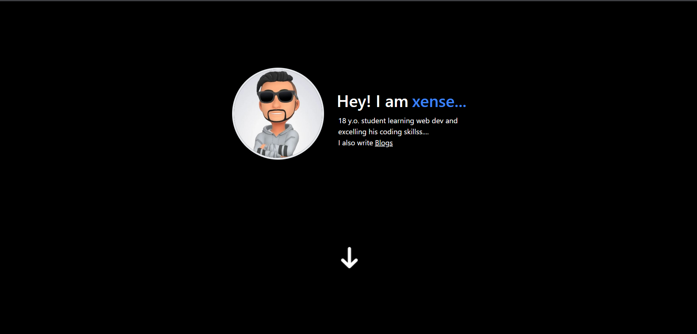

# Nextjs Tailwind sanity starter template

- **Nextjs repsponsive** portfolio blog template ,with **Tailwindcss and sanity.io**.


<!-- add mobile image later -->
[](https://github.com/xenseee/portfolio-blog/stargazers/)
[](https://github.com/xenseee/portfolio-blog/network/)
[](https://twitter.com/xenseee)
</br>
[](https://vercel.com/new/git/external?repository-url=https://github.com/xenseee/portfolio-blog)

## Demo

- [Demo Blog](https://portfolio-blog-xense.vercel.app/) - this repo

## Features

- Sanity CMS
- Responsive design
- Tailwindcss
- Attractive Design

## Installation

Install node modules with yarn

```bash
  yarn add
  cd portfolio-blog
```

## Host Locally

```bash
    yarn dev
```

Open [http://localhost:3000](http://localhost:3000) with your browser to see the result.

## Environment Variables

To run this project, you will need to add the following environment variables to your .env file

`NEXT_PUBLIC_SANITY_DATASET`
`NEXT_PUBLIC_SANITY_PROJECT_ID`
`SANITY_API_TOKEN`

## Extend / Customize

`.env.example` - add your own environmet variables from sanity

`components/containers/Hero.tsx` - Add your own name and introduction

`components/containers/Skills.tsx` - Add your own skills.

`components/containers/Contact.tsx` - navigation links.

`components/containers/Footer.tsx` - update link

`public/assets/data/logo.png` - replace with your own logo.

`public/favicon.ico` - replace favicon

## Deploy

**Vercel**  
The easiest way to deploy the template is to use the [Vercel Platform](https://vercel.com) from the creators of Next.js. Check out the [Next.js deployment documentation](https://nextjs.org/docs/deployment) for more details.

**Netlify / GitHub Pages / Firebase etc.**  
As the template uses `next/image` for image optimization, additional configurations have to be made to deploy on other popular static hosting websites like [Netlify](https://www.netlify.com/) or [GitHub Pages](https://pages.github.com/). An alternative image optimization provider such as Imgix, Cloudinary or Akamai has to be used. Alternatively, replace the `next/image` component with a standard `` tag. See [`next/image` documentation](https://nextjs.org/docs/basic-features/image-optimization) for more details.

### Want to discuss? 💬

Have any questions, doubts or want to present your opinions, views? You're always welcome. You can [start discussions](https://github.com/xenseee/portfolio-blog/discussions).

## Licence

[MIT](https://github.com/xenseee/portfolio-blog/blob/master/LICENSE) © [xense](https://xense.vercel.app)

## Support

Using the template? Support this effort by giving a star on GitHub.

### Want to Contribute 🙋‍♂️?

Want to contribute? Great!
All contributions are welcome, from code to documentation to graphics to design suggestions to bug reports. Please use GitHub to its fullest-- contribute Pull Requests, contribute tutorials or other wiki content-- whatever you have to offer, we can use it!

**Please Donate to support me and my work!**
</br>
[](https://ko-fi.com/xensee)
</br>

## 🚀 About Me

I'm a full stack developer...

## 🔗 Links

[](https://xense.vercel.app/)
<!-- [](https://www.linkedin.com/) -->
[](https://twitter.com/xenseee)
